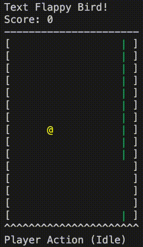

# 🎮 Reinforcement Learning for Text Flappy Bird 🐤

This repository contains the complete implementation and analysis of a reinforcement learning project using the **Text Flappy Bird Gym** environment. The goal is to train and compare tabular RL agents on a simplified version of the Flappy Bird game.




## 📁 Contents

- `code.ipynb` — Jupyter notebook with all experiments, agent code, and analysis.
- `report.pdf` — Final report.
- `README.md` — Project overview and usage instructions.


## 🧠 Agents Implemented

- **Monte Carlo First-Visit**
- **Monte Carlo Every-Visit**
- **Sarsa(λ = 0)** (TD(0))
- **Sarsa(λ = 0.9)** (with eligibility traces)

All agents use an $\epsilon$-greedy policy and tabular Q-value updates. The project uses the simplified environment `TextFlappyBird-v0`, which exposes a 2D state: `(horizontal_distance, vertical_offset)`.


## 🔧 Environment Setup

You can install the environment using the following command:

```bash
pip install git+https://gitlab-research.centralesupelec.fr/stergios.christodoulidis/text-flappy-bird-gym
